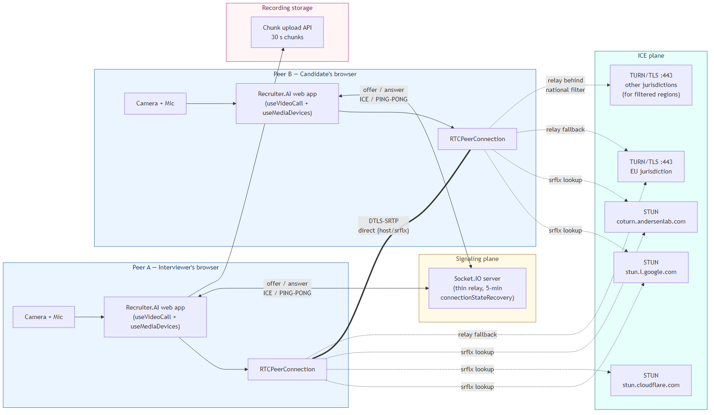
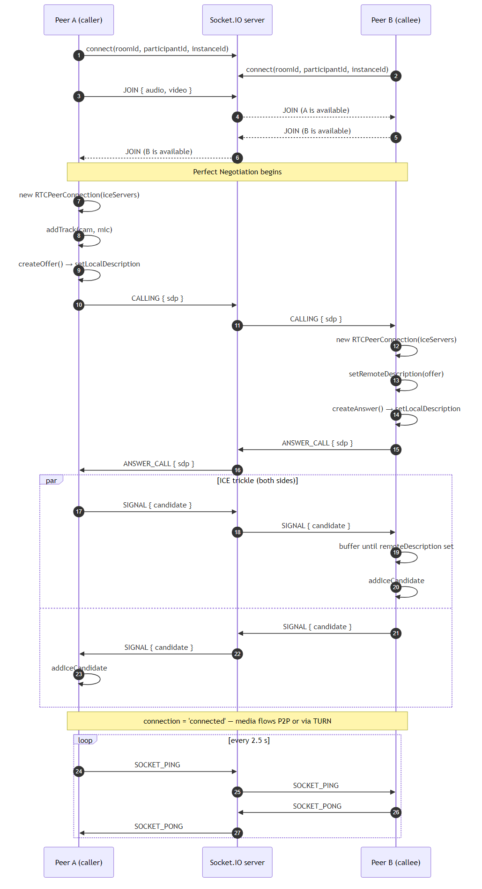
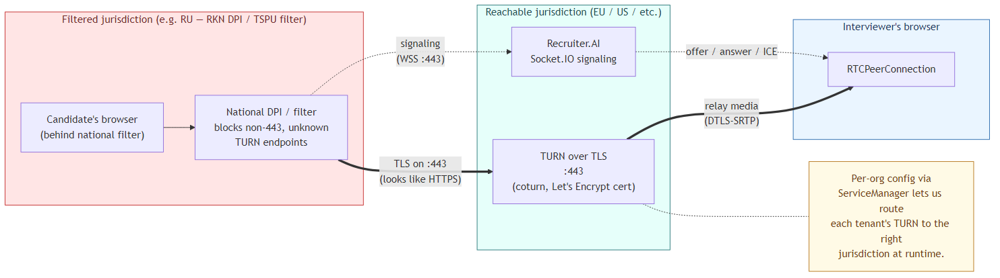
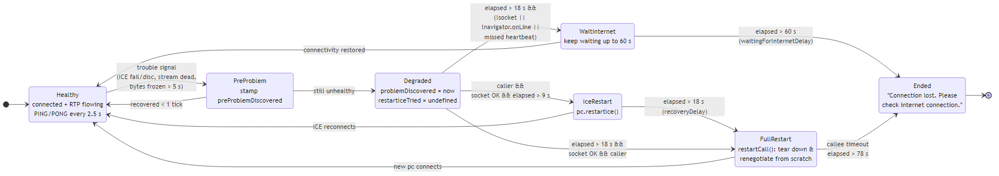
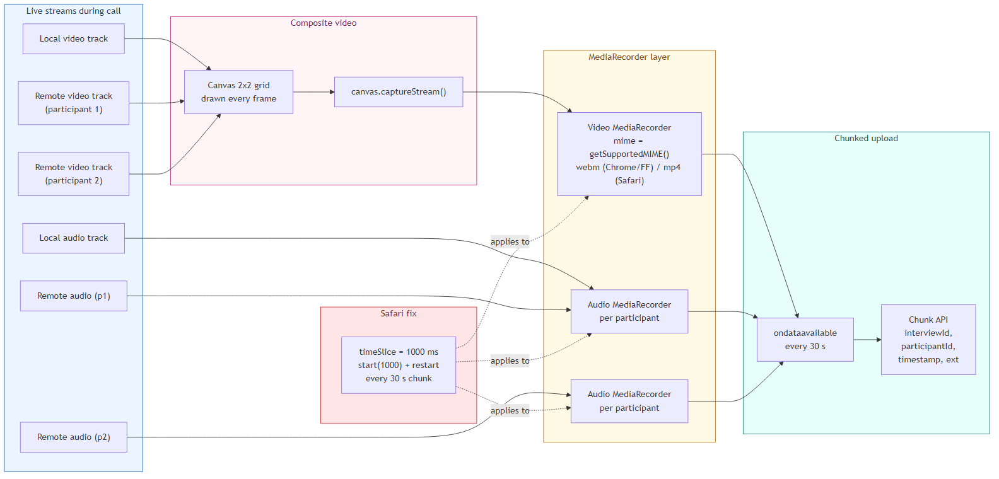

# Надежная архитектура видеозвонков на WebRTC

*Как мы спроектировали, реализовали и проверили на практике движок видеосвязи, который лежит в основе видеоинтервью и режима самостоятельной видеозаписи ответов внутри [Recruiter.AI](https://recruiter-ai.andersenlab.com/), и какой длинный список проблем нам пришлось решить по пути.*

Прежде чем перейти к деталям, коротко обозначим рамки этой статьи. WebRTC — огромная тема, о которой написаны целые книги. Это не учебник по WebRTC. Это разбор конкретной архитектуры и конкретных инженерных решений, которые мы приняли для функций видеосвязи в Recruiter.AI, а также причин, по которым мы приняли именно их.

Код видеозвонков можно найти в [репозитории GDMN Meet](https://github.com/gsbelarus/gdmn-meet), попробовать вживую на [meet.gdmn.app](https://meet.gdmn.app) или увидеть в работе в [сценарии интервью Recruiter.AI](https://recruiter-ai.andersenlab.com/).

## 1. Зачем это было нужно

[Recruiter.AI](https://recruiter-ai.andersenlab.com/) от **Andersen Lab** — это платформа для найма с поддержкой ИИ. Две ее наиболее заметные функции — **видеоинтервью** между кандидатом и интервьюером и **режим самостоятельной видеозаписи ответов**, где кандидат один отвечает на вопросы перед камерой, — зависят от живого видеопотока, который должен *просто работать*. Не в лаборатории. А в спальне кандидата, в гостинице по Wi‑Fi, в нестабильной мобильной сети, за корпоративным файрволом, за национальной системой DPI-фильтрации.

О чем пойдет речь:

- о сквозной архитектуре и о том, почему она выглядит именно так;
- о том, почему мы сделали собственный тонкий сигнальный сервер на Socket.IO;
- о STUN, TURN и **проблеме юрисдикций** (например, той самой, из-за которой звонки перестают работать внутри сетей, фильтруемых российским РКН);
- о паттерне идеального согласования (Perfect Negotiation) с буферизацией ICE-кандидатов;
- о многоуровневом восстановлении соединения, которое помогает переживать плохие каналы связи;
- о том, как мы обнаруживаем *замершие* медиапотоки, которые любой браузер по-прежнему считает «подключенными»;
- о Chrome, Firefox и Safari — и конкретных обходных решениях для них;
- о проверке оборудования и горячей замене камер и микрофонов прямо во время звонка;
- о конвейере записи (компоновка через `canvas` + загрузка чанками + исправление для Safari, на поиск которого ушло два дня);
- об инструментах, которые мы собрали, чтобы все это тестировать.


## 2. Общая картина



На верхнем уровне здесь есть четыре плоскости:

- **Медиаплоскость (P2P).** Два `RTCPeerConnection` обмениваются зашифрованным трафиком DTLS-SRTP, в идеале — напрямую, по одноранговой схеме (peer-to-peer).
- **Плоскость сигнального обмена.** Тонкий сервер Socket.IO, предоставляемый сервером приложения, пересылает типизированные сообщения между участниками комнаты и хранит ровно столько информации о присутствии, сколько нужно для отклонения дублирующихся подключений.
- **ICE-плоскость.** STUN-серверы (Google, Cloudflare и наш собственный coturn) для обхода NAT (NAT traversal), а также набор **TURN поверх TLS (TURN over TLS)** на порту 443, которые берут медиатрафик на себя, когда прямое P2P-соединение установить не удается, — а это происходит чаще, чем кажется.
- **Приемник записи.** API чанковой загрузки, принимающий 30-секундные медиаблоки, которые производит `CallRecorder`.

На клиенте ответственность разделена между двумя взаимодействующими хуками, связанными тонким интеграционным слоем: один отвечает за `RTCPeerConnection`, сигнальный обмен и восстановление соединения; второй управляет камерами, микрофонами, отслеживанием горячего подключения устройств и локальным потоком. Разделить эти обязанности было одним из первых правильных решений: горячая замена устройств по ходу звонка и без того достаточно сложна, чтобы не нагружать тот же слой еще и состоянием сигнального обмена.

## 3. Сигнальный сервер: тонкий, восстанавливаемый, свой

Для сигнального обмена мы поднимаем точку подключения Socket.IO как часть сервера приложения. Его задача узкая и строго определенная:

1. **Тупой ретранслятор.** Сервер только пересылает сообщения и больше ничего. Состояние звонка на сервере не хранится, а значит протокол сигнального обмена можно развивать без серверных изменений.
2. **Самовосстановление** на уровне сокета, чтобы кандидат, у которого на десять секунд пропал Wi‑Fi, не был вынужден обновлять страницу.
3. **Минимальная осведомленность о присутствии.** Сервер отслеживает состав комнаты ровно настолько, чтобы отклонять повторные входы одного и того же участника (об этом ниже).

Именно второй пункт стал причиной, по которой мы выбрали Socket.IO, а не чистый WebSocket: в Socket.IO есть `connectionStateRecovery`, которое буферизует события в течение настраиваемого окна и возобновляет сессию, если клиент успевает переподключиться. У нас это окно выставлено в **пять минут**.

Сам протокол очень небольшой: девять типов сообщений — JOIN/LEAVE, ENUM, CALLING, ANSWER_CALL, SIGNAL (который инкапсулирует и SDP, и ICE), SOCKET_PING/PONG, RESTART_CALL, END_CALL, MAKE_CALL. В каждом сообщении есть `fromId`/`toId`, благодаря чему серверу не нужно хранить состояние о том, кто с кем разговаривает.

Последовательность успешной установки звонка:



В процессе начального подключения есть две небольшие, но важные детали:

- Каждая попытка подключения отправляет новый `instanceId` (UUID v4) вместе с `participantId`. Если вторая вкладка входит с тем же `participantId`, сервер отвечает `already_in_room`, и вторая вкладка отступает. Так мы обнаруживаем и отклоняем **дублирующиеся входы** (это самая частая причина жалоб вида «я вижу себя два раза в сетке» от тестировщиков).
- При закрытии вкладки клиент отправляет сообщение LEAVE через `navigator.sendBeacon()`. `window.onbeforeunload` ненадежен в мобильных браузерах; `sendBeacon` надежнее.


## 4. STUN, TURN и проблема юрисдикций

Получить ICE-кандидаты — простая часть: указываешь в `RTCPeerConnection` несколько публичных STUN-серверов, и на этом все. Конфигурация по умолчанию такая:

- `stun:stun.l.google.com:19302`
- `stun:stun.cloudflare.com:3478`
- наш собственный сервер — для резервирования

Сложная часть — TURN. Заметная доля пользователей — корпоративные сети, симметричный NAT (symmetric NAT), мобильные операторы с carrier-grade NAT и, что особенно важно для Recruiter.AI, **пользователи внутри национально фильтруемых сетей** — не могут установить прямое одноранговое соединение. Им нужен ретранслятор.

Поэтому мы подняли собственный экземпляр **coturn** и, что особенно важно, открыли TURN на порту **443**. Адрес ICE-сервера выглядит так:

```text
turns:coturn.our_server.com:443
```

Порт 443 имеет значение. Многие корпоративные файрволы и национальные DPI-фильтры пропускают TLS по TCP/443, потому что блокировка этого трафика ломала бы HTTPS. TURN-сервер, слушающий этот порт внутри корректного TLS-туннеля, для большинства DPI неотличим от обычной HTTPS-сессии. Именно поэтому мы используем **TURN поверх TLS (TURN over TLS) на :443**, а не стандартные транспорты UDP 3478 или TCP 5349.

Но есть еще один нюанс, особенно важный для запуска Recruiter.AI для пользователей в странах с жесткой фильтрацией трафика.

### Проблема российской фильтрации

Российская инфраструктура национальной фильтрации трафика (система РКН, включая ТСПУ-оборудование на точках пиринга провайдеров) блокирует не только *известные* адреса. Она также режет соединения к узлам, чьи IP-адреса или имена хостов в SNI попали в списки фильтрации, и становится все агрессивнее в отношении трафика, который *похож* на WebRTC: долгоживущих UDP-потоков или характерных STUN-шаблонов поверх TCP. TURN-сервер, который безупречно работает из Амстердама, может внезапно перестать быть доступным из Москвы буквально за ночь, потому что трафик *чужого* сервиса из того же диапазона IP «отравил» фильтр.

Практический вывод таков: **одного TURN-развертывания — даже хорошего — недостаточно**. В итоге мы начали размещать TURN-серверы в разных юрисдикциях, чтобы для пользователей из каждого конкретного региона всегда находился доступный ретранслятор, чей IP-адрес или имя хоста (hostname) остается «чистым» именно для *их* сетевого маршрута. Конфигурация WebRTC определяется для каждой организации во время выполнения через внутренний реестр сервисов, а запасным вариантом служит конфигурация из переменных окружения. Это позволяет направлять тенантов в тот пул TURN-серверов, чья юрисдикция и IP-гигиена реально работают для них, не требуя повторного развертывания.



### Построение конфигурации

Сборщик конфигурации — это то место, где JSON из переменных окружения превращается в `RTCConfiguration`. Он небольшой, но именно там неверные значения по умолчанию особенно эффектно взрываются, поэтому мы сделали его строгим:

```ts
// packages/hooks/src/useVideoCall/useVideoCall.ts:24
export const getRTCConfiguration = ({ stun, turn, icePolicy }: WebRTCConfig): RTCConfiguration => {
  const config: RTCConfiguration = {
    iceServers: [
      ...turn.map(s => ({
        urls: s.urls,
        username: s.username || '1',
        credential: s.credential || '1',
      })),
      ...stun.map(s => ({ urls: s.urls })),
    ].filter(Boolean),
    iceTransportPolicy: icePolicy,
  };
  return config;
};
```

`icePolicy` настраивается: по умолчанию это `'all'`, но на уровне конфигурации его можно переключить в `'relay'` — что удобно для отладки или для тех тенантов, которым по юридическим причинам нужен единый путь через TURN, — и при этом не трогать код звонка.


## 5. Идеальное согласование (Perfect Negotiation) с буферизацией ICE

Два узла могут одновременно попытаться создать предложение соединения (`offer`) — классическую коллизию предложений (`glare`) в WebRTC. Паттерн W3C [Perfect Negotiation](https://w3c.github.io/webrtc-pc/#perfect-negotiation-example) назначает одну сторону «вежливой» (`polite`) и позволяет ей откатить собственное локальное описание, если входящий `offer` сталкивается с ее собственным. Мы реализуем его стандартным набором флагов `makingOffer`, `ignoreOffer` и `polite`. Вежливой стороной выступает вызываемая сторона.

Но есть один нюанс, который регулярно кусает: ICE-кандидаты могут прийти *раньше*, чем будет установлено удаленное описание (`remote description`), особенно в медленной сети, где SDP проходит долго, а ICE уже начинает поступать сразу после этого. Вызов `addIceCandidate` до `setRemoteDescription` в современных браузерах приводит к исключению. Поэтому мы **буферизуем** ICE-кандидаты для каждого узла и сбрасываем буфер только после успешного `setRemoteDescription`. На практике буфер обычно невелик — несколько кандидатов, — но без него звонок тихо не устанавливается на плохих сетях.


## 6. Восстановление соединения по ступеням

Эта часть потребовала больше всего итераций. WebRTC дает `connectionState`, `iceConnectionState`, `iceGatheringState`, `signalingState` — и как минимум одно из этих состояний в любой момент вас обманывает. Узел с `connectionState === 'connected'` все еще может передавать ноль байт, если маршрут тихо провалился в черную дыру маршрутизации. Узел в `iceConnectionState === 'disconnected'` может восстановиться сам через секунду, если просто подождать.

Поэтому мы совместили несколько сигналов и построили ступенчатую лестницу восстановления с пятью порогами:

```ts
const heartbeatDelay = 2500;
const heartbeatThreshold = heartbeatDelay * 2; // 5 s
const statsDelay = 5_001;
const recoveryDelay = 18_000;                  // full restart
const iceRestartDelay = recoveryDelay / 2;     //  9 s — ICE restart
const videoWarmUpDelay = 8_000;
const waitingForInternetDelay = 60_000;        // give up
```

Лестница выглядит так:



Если перевести в обычные слова:

1. **Каждые 2,5 с** каждая сторона отправляет `SOCKET_PING`; в ответ вторая сторона шлет `SOCKET_PONG`. Два пропущенных ответа подряд (5 с) означают, что сокетный маршрут, скорее всего, умер.
2. **Примерно каждые 5 с** запускается опрос статистики через `pc.getStats()`, и мы сравниваем счетчики RTP-байтов. Если ни входящие, ни исходящие байты не изменились, медиапоток замер вне зависимости от того, что говорит машина состояний.
3. На **первом** тике, где что-то выглядит плохо (`connectionState === 'failed'`, ICE disconnected/closed, stream inactive или байты перестали двигаться), мы ставим отметку `preProblemDiscovered`. Если на следующем тике ситуация все еще плохая, она повышается до `problemDiscovered`. Одно это подтверждение на следующем тике уже убрало большинство ложных срабатываний в тестах.
4. **Через 9 с** настоящей проблемы, если сокет еще жив и мы являемся инициатором звонка, вызывается `pc.restartIce()`. Это запускает повторное ICE-пересогласование без разрушения соединения между узлами — дешево и быстро, если сработало.
5. **Через 18 с** мы эскалируем до полного `restartCall()`: закрываем `RTCPeerConnection`, отправляем `RESTART_CALL` через сокет, чтобы другая сторона сделала то же самое, и пересобираем все с нуля. Дорого, но надежно.
6. **Если сам сокет недоступен** или `navigator.onLine === false`, мы ждем вместо рестарта — рестартовать все равно не через что. Ожидание длится до 60 с; только после этого интерфейс показывает: "Connection lost. Please check internet connection."

Логика ветвления здесь плотная, и чтобы довести ее до ума, понадобилось много прогонов на ограниченной сети. Ключевой блок из цикла статистического тика выглядит так:

```ts
if (elapsed > recoveryDelay) {
  if (!socket?.connected || !navigator.onLine || missedHeartbeat(p.socketPingReceived)) {
    if (elapsed > waitingForInternetDelay) {
      if (!socket?.connected) {
        endCall(p, 'Connection lost. Please check internet connection.');
      } else {
        endCall(p);
      }
    } else {
      updateParticipant(p.id, { healthCheck: Date.now() });
    }
  } else {
    if (p.role === 'caller') {
      restartCall(p);
    } else {
      // caller must manage the call, but if it avoids its responsibilities...
      if (elapsed > (waitingForInternetDelay + recoveryDelay)) {
        endCall(p);
      } else {
        updateParticipant(p.id, { healthCheck: Date.now() });
      }
    }
  }
}
```

Стоит отдельно отметить две тонкости:

- **Только инициатор звонка (`caller`) инициирует рестарт.** Если обе стороны одновременно начнут рестарт, они бесконечно будут конфликтовать на SDP. Принимающая сторона (`callee`) пассивно следует за ним. Но если `caller` *самоустранился* — например, его вкладка была усыплена, — `callee` через большее время тоже сдается и завершает звонок самостоятельно (`waitingForInternetDelay + recoveryDelay = 78 s`).
- Время «сколько прошло с момента проблемы» вычисляется относительно `Math.max(problemDiscovered, lastSocketConnected, socketPingRestored, lastIceStateChange)`. Если сокет дернулся или ICE ненадолго восстановился, часы восстановления сбрасываются. Без этого звонок, переживший короткий обрыв, все равно был бы убит уже после стабилизации.


## 7. Как мы определяем замерший медиапоток

Возможно, самый приятный фрагмент кода во всем проекте одновременно и самый маленький. Мы держим скользящую дельту RTP-байтов из `pc.getStats()`. Если и по отправленным, и по полученным байтам дельта остается нулевой на протяжении целого окна статистики, соединение мертво — что бы ни утверждал `iceConnectionState`:

```ts
function isDataTransmitted<S>(p: Participant<S>) {
  if (
    p.statInterval &&
    p.bytesReceived !== undefined &&
    p.bytesTime !== undefined &&
    p.bytesPrevReceived !== undefined &&
    p.bytesPrevTime !== undefined &&
    p.bytesSent !== undefined &&
    p.bytesPrevSent !== undefined
  ) {
    const deltaTime = p.bytesTime - p.bytesPrevTime;
    const deltaReceived = p.bytesReceived - p.bytesPrevReceived;
    const deltaSent = p.bytesSent - p.bytesPrevSent;
    // only judge if there were enough time to transmit some data
    // Connection is alive if EITHER data is being received OR sent (not both required)
    return deltaTime < statsDelay || (deltaReceived > 0 || deltaSent > 0);
  } else {
    return true;
  }
}
```

Решение использовать `deltaReceived > 0 || deltaSent > 0` вместо `&&` было осознанным. Одна из сторон вполне может быть заглушена; требовать движения *обоих* потоков байтов значило бы получать ложные тревоги о «мертвом звонке», когда участник просто молчит. Пока движется хоть что-то, канал жив.

Также есть небольшая льготная пауза для *первичного* старта медиапотока после установления звонка (`videoWarmUpDelay = 8_000`). Некоторые браузеры — особенно Safari — заметно медлят с первым видеокадром даже после `connectionState === 'connected'`. Жаловаться на «нет видео» раньше восьми секунд — значит генерировать ложноположительные срабатывания.


## 8. Войны браузеров: Chrome, Firefox, Safari

Ничто в этом проекте не съело столько времени, сколько кросс-браузерные странности. Вот конкретные случаи, которые стоит зафиксировать.

### Safari: `MediaRecorder` молчит, пока его не попросишь правильно

В Chrome и Firefox вызов `MediaRecorder.start()` без аргументов дает один большой объект `Blob` на `stop()` либо периодические `Blob`, если передать `timeSlice` в миллисекундах. В Safari `start()` без `timeSlice` может тихо никогда ничего не отдать. Рекордер *считает*, что записывает, — без ошибок, без отклоненных промисов, просто вечная пустота.

Именно на этом мы потеряли два дня в сценарии самостоятельной видеозаписи ответов. Исправление — зависящий от браузера флаг `useTimeSlice` в обоих классах записи:

```ts
this.useTimeSlice = browserName === "Safari";
…
if (this.useTimeSlice && this.TIME_SLICE > 0) {
  this.mediaRecorder.start(this.TIME_SLICE); // 1000 ms
} else {
  this.mediaRecorder.start();
}
```

Есть и второй уровень проблемы: когда наступает граница 30-секундного чанка и рекордер останавливается с последующим перезапуском, Safari снова начинает выдавать данные только если `timeSlice` передается в `start()` *каждый раз*. Поэтому тот же флаг управляет и путем перезапуска.

### Firefox: названия устройств пустые, пока не запросишь доступ

`navigator.mediaDevices.enumerateDevices()` возвращает `label: ""` для каждого устройства до тех пор, пока хотя бы раз не был выдан доступ через `getUserMedia()`. В Chrome подписи могут появляться до повторного запроса разрешения, если сайт уже был авторизован; в Firefox — нет. Поэтому мы сначала перечисляем устройства, затем запрашиваем доступ, а потом **перечисляем устройства повторно** и уже обновленные подписи используем для селекторов устройств.

### Выбор MIME

Chrome и Firefox предпочитают WebM (видео VP8/VP9, аудио Opus). Safari стабильно кодирует только MP4 с AVC и AAC. При загрузке мы выполняем проверку поддержки и выбираем лучший доступный вариант, а для Safari откатываемся к `'video/mp4; codecs="avc1.42E01E, mp4a.40.2"'`. Это решение влияет и на расширение загружаемого файла (`.webm` против `.mp4`), которое бэкенд использует для маршрутизации в соответствующий конвейер последующей обработки (post-processing pipeline).

### iOS

На iOS в параметрах видео (`video constraints`) мы всегда указываем `facingMode: 'user'`, чтобы по умолчанию включалась фронтальная камера; `deviceId: { exact: … }` на iOS иногда выбирает не тот объектив, которого ожидаешь. Маленький, но устойчивый источник жалоб, пока мы не стандартизировали поведение через `facingMode`.


## 9. Оборудование: проверить, заменить, восстановить

Поскольку интервью и самостоятельная видеозапись ответов — это *записываемые* оценки реальных людей, корректная работа оборудования критична. Здесь помогают три вещи.

### 9.1 Предзвонковая проверка микрофона

Перед входом в звонок пользователю показывается модальное окно проверки звука с живым индикатором громкости, которое проводит его через тест микрофона. Мы поднимаем `AudioContext` + `AnalyserNode` на отдельном потоке `getUserMedia({ audio: { deviceId: { exact } } })`, снимаем частотные данные, отслеживаем пиковое значение в dB и сравниваем его с порогом в −35 dB. Если микрофон пользователя не поднимается выше этого порога, мы предупреждаем его еще до старта звонка, а не после того, как интервьюер уже ждет.

### 9.2 Горячая замена во время звонка

Если кандидат подключил USB-наушники посреди звонка, звонок не должен умереть. Здесь есть две части:

- Хук управления медиоустройствами слушает `navigator.mediaDevices.ondevicechange` с задержкой в 1 секунду (во время подключения одного устройства событие обычно срабатывает несколько раз подряд).
- Когда пользователь выбирает новое устройство, соединение не пересогласуется — трек подменяется под ним через `RTCRtpSender.replaceTrack()`:

```ts
// useVideoCall switchTrack (wired from useMediaDevices)
for (const p of participantsRef.current) {
  if (p.state === 'in-call' && p.pc) {
    const sender = p.pc.getSenders().find(s => s.track?.kind === newTrack.kind);
    if (sender) {
      await sender.replaceTrack(newTrack); // no renegotiation
    }
  }
}
localStreamRef.current = newStream;
```

`replaceTrack` здесь — правильный инструмент: нового offer/answer не требуется, удаленная сторона видит непрерывный трек, а рекордер (если он уже идет) продолжает работу.

### 9.3 Восстановление, когда устройство исчезло

Если активная камера или микрофон *исчезает* — USB вытащили, доступ на уровне ОС был отозван, браузер решил внезапно подменить устройство, — срабатывает двухступенчатое восстановление:

- **Мягкое восстановление.** Обработчик `track.onended` помечает тип устройства как «нуждается в замене». Затем срабатывает задержка на `devicechange`, мы заново перечисляем устройства, выбираем первое доступное устройство нужного типа и вызываем `switchDevices` через тот же путь `replaceTrack`, что и при обычной пользовательской замене. Для удаленного узла ничего не произошло.
- **Жесткое восстановление.** Если замены нет (все камеры отключены, разрешения отозваны), локальный поток корректно останавливается, сохраняется контекст восстановления со старыми и новыми `deviceId`, а наверх поднимается типизированная ошибка (`isNotAllowedError`, `isNotFoundError`, `isNotReadableError`, `isOverconstrainedError`) в специальный интерфейс обработки ошибок медиаустройств. Он использует флаги ошибки, чтобы показать правильную рекомендацию: «Выдайте доступ к камере», «Подключите камеру», «Закройте другое приложение, которое использует камеру» и так далее.

Есть еще одна дополнительная тонкость: функция виртуального фона создает собственный **синтетический трек** с поддельным `deviceId`. Если бездумно записать этот синтетический ID обратно в состояние выбранной камеры, пользователь в следующий раз откроет панель настроек и увидит UUID, который не соответствует ни одному реальному устройству. Исправление состояло в разделении **намерения пользователя** (`selectedCameraId`) и **рабочего состояния** (`currentCamera`): когда фон включен, мы запоминаем исходный ID выбранной камеры, а не синтетический.

Все операции с устройствами сериализуются через семафор (`Semaphore`), чтобы быстрые клики пользователя по выпадающему списку устройств не приводили к перекрывающимся `getUserMedia`-вызовам и не оставляли после себя висячие треки.

---

## 10. Конвейер записи

У записи был свой набор сложностей, потому что видеозвонок *многопользовательский* (интервьюер + кандидат, иногда больше), а результат должен быть единым удобным для просмотра артефактом.



Для звонка (`CallRecorder`):

- Видеоэлемент `<video>` каждого участника отрисовывается в **сетку 2×2 на `canvas`** на каждом кадре отрисовки (`animation frame`). `canvas.captureStream()` превращает это в `MediaStream` с одним составным видеотреком.
- Этот составной поток подается в один `MediaRecorder` для видео.
- Параллельно аудиотрек каждого участника поступает в **собственный** `MediaRecorder`. Разделение аудио упрощает последующую транскрибацию по спикерам (не нужно разделять смешанный звук) и одновременно обходит проблему, что WebRTC-аудиотреки трудно качественно сводить на лету без потерь.
- Каждые 30 секунд рекордеры ротируются: `stop()` отдает последний объект `Blob` через `ondataavailable`, после чего `start(TIME_SLICE)` начинает следующий чанк. Каждый `Blob` сразу загружается на сервер с тегами `interviewId`, `participantId`, `timestamp` и расширением медиа-типа. Если загрузка падает, этот чанк повторно отправляется независимо — ни один кратковременный сетевой сбой не должен приводить к потере всей записи.

Для режима самостоятельной видеозаписи ответов (`AssessmentRecorder`) компоновка не нужна — спикер один, — поэтому достаточно одного рекордера для объединенного потока. Что добавляет `AssessmentRecorder`, так это **барьер завершения на основе Promise (promise-based stop barrier)**: `stopRecording()` возвращает promise, который резолвится только после того, как последний `Blob` прошел через `ondataavailable`, чтобы код интерфейса, желающий заменить устройство, точно знал, что поток уже безопасно останавливать.

Оба рекордера учитывают Safari-фикс с `timeSlice` из §8.


## 11. Тестирование в реальном мире

Юнит-тесты умеют ловить баги протокола, но никакой юнит-тест не скажет вам, что coturn во Франкфурте на этой неделе недостижим из конкретного российского ISP. Поэтому мы сделали клиентскую диагностическую проверку.

Для каждого сервера он поднимает временный `RTCPeerConnection`, указывает ему ровно один этот STUN- или TURN-сервер, создает канал данных (`data channel`), чтобы принудительно запустить сбор кандидатов, и ждет, пока ICE либо завершится успешно, либо упадет. Результат один из трех:

- Рабочий STUN-сервер должен дать кандидата типа `srflx`.
- Рабочий TURN-сервер должен дать кандидата типа `relay`.
- Все остальное — тайм-аут через 10 секунд или ошибка соединения — означает, что этот сервер *для данного клиента* не работает.

Результат приводится к простой форме `{ url, type, status, candidates[], duration }` и отображается на внутренней диагностической странице. Когда пользователь сообщает: «Звонок не подключается», он может нажать одну кнопку и сразу увидеть, какие серверы доступны из его сети. Это сократило наш цикл отладки с «много дней переписки по почте» до «одного скриншота».

Поверх серверных проверок в сценарии интервью есть еще и механизм контроля нарушений (`anti-cheating`), который фиксирует переключения вкладок во время интервью. Сам по себе это не WebRTC-проблема, но он работает через тот же сокетный канал, а отсутствие сигнала о переключении вкладки — полезный побочный индикатор того, что соединение сломано.


## 12. Что мы из этого вынесли

В сжатом виде и без особого порядка:

- **Не доверяйте ни одной отдельной машине состояний WebRTC.** Перепроверяйте состояние по дельте RTP-байтов через `getStats()`. `'connected'` — это не факт, а заявление.
- **Буферизуйте ICE-кандидаты.** На медленном канале они *обязательно* придут раньше, чем завершится `setRemoteDescription`.
- **Эскалируйте восстановление постепенно.** Пульсовая проверка (`heartbeat`) → перезапуск ICE → полный перезапуск → ожидание интернета. Если слишком рано перейти к полному рестарту, это хуже, чем дать звонку прожить еще 10 секунд в деградировавшем режиме.
- **Восстановлением должна управлять только одна сторона.** Инициатор звонка (`caller`) рестартует, принимающая сторона (`callee`) следует. Если рестартуют оба, получается хаос.
- **Поднимайте собственный coturn на :443 с TLS.** Бесплатные STUN-серверы подходят; бесплатных TURN-серверов либо не существует, либо они не масштабируются, либо находятся не в той стране.
- **Размещайте TURN в нескольких юрисдикциях**, если ваши пользователи находятся за национальными фильтрами. Российский кейс сделал это для нас обязательным, но та же логика применима к корпоративному DPI и строгим мобильным операторам где угодно. Конфигурация на уровне тенанта позволяет направлять клиенту подходящий пул TURN без повторного развертывания.
- **Используйте `replaceTrack` для замены устройств.** Пересогласование всего соединения на каждый клик «сменить микрофон» — это медленно и хрупко.
- **Разделяйте намерение пользователя и рабочее состояние**, когда в игру входят виртуальные фоны или другие синтетические треки. Будущая версия вас за это поблагодарит.
- **`MediaRecorder` в Safari требует `timeSlice`.** Всегда. И повторно передавайте его после каждого stop/start.
- **Firefox требует повторного перечисления устройств после выдачи разрешения.** Иначе список устройств будет заполнен пустыми именами.
- **Сделайте собственную проверку доступности серверов.** Цена — одна суббота; выигрыш — возможность диагностировать сломанную пользовательскую сеть за 30 секунд.

Видеозвонок в Recruiter.AI продолжает развиваться — в планах есть настройки кодеков, simulcast и адаптивное качество по пропускной способности, — но архитектурный каркас, описанный здесь, уже выдержал тысячи реальных интервью и сеансов самостоятельной видеозаписи ответов, в том числе на сетях, от которых любой инженер WebRTC невольно поморщится. Если вы строите что-то похожее, начинайте не с интерфейса, а с лестницы восстановления и TURN-стратегии. Все остальное вытекает уже из этих двух вещей.
