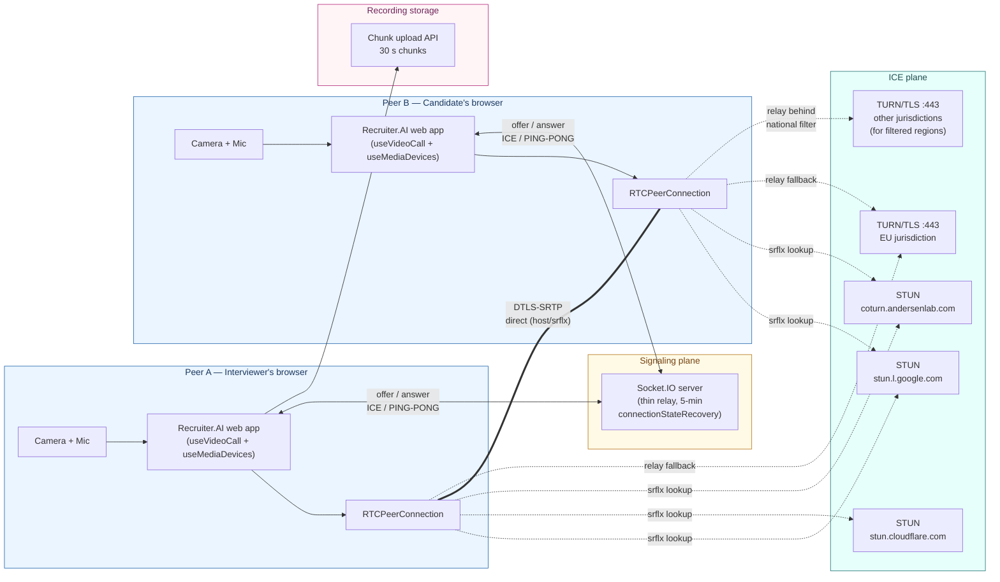
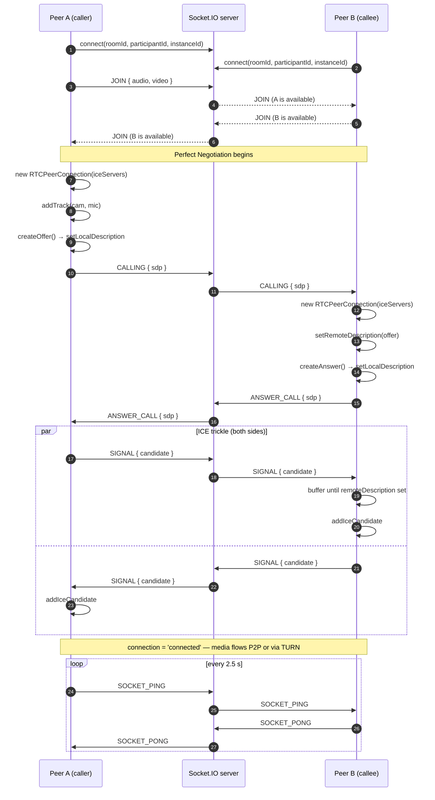
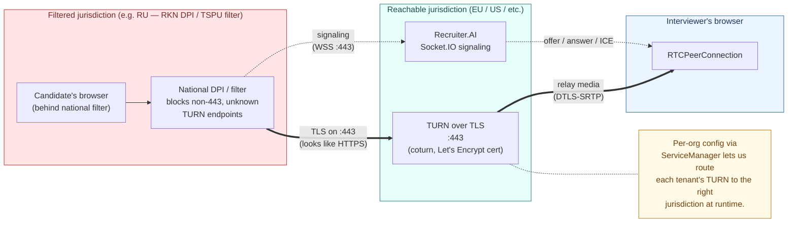
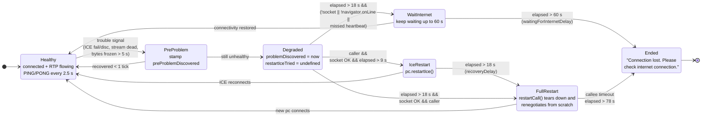
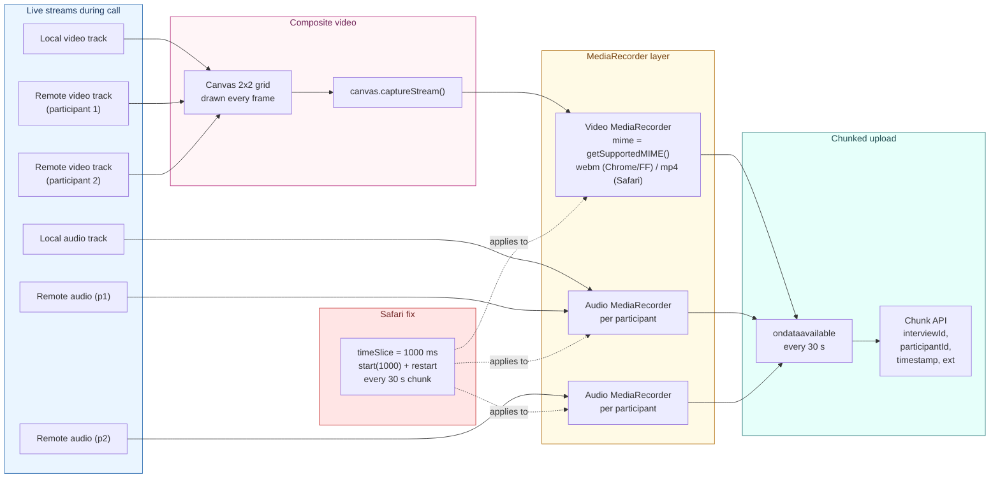

# Building a Resilient WebRTC Video Call

*How we designed, built, and battle‑tested the video calling engine that powers video interviews and video self‑assessment inside [Recruiter.AI](https://recruiter-ai.andersenlab.com/) — and the long list of problems we had to beat along the way.*

Before we dive in, a quick note on the scope of this article. WebRTC is a huge topic, and there are entire books written about it. This is not a WebRTC tutorial. It’s a postmortem of the specific architecture and design decisions we made for Recruiter.AI’s video calling features, and the rationale behind them. 

You can find the video call code in the [GDMN Meet repository](https://github.com/gsbelarus/gdmn-meet), try it out on [meet.gdmn.app](https://meet.gdmn.app), or see it in action in the [Recruiter.AI interview flow](https://recruiter-ai.andersenlab.com/). 

## 1. Why this was built

[Recruiter.AI](https://recruiter-ai.andersenlab.com/) from **Andersen Lab** is a platform for AI‑assisted hiring. Two of its most visible features — **video interviews** between a candidate and an interviewer, and **video self‑assessment** where a candidate records answers to questions alone in front of the camera — depend on a live video stream that has to *just work*. Not in the lab. In a candidate's bedroom, on a hotel Wi‑Fi, on a flaky mobile network, behind a corporate firewall, behind a national DPI filter.

What we will cover:

- the end‑to‑end architecture and why it looks the way it does;
- why we built our own thin Socket.IO signaling server;
- STUN, TURN, and the **jurisdiction problem** (for example, the one that stops calls working inside Russian RKN‑filtered networks);
- Perfect Negotiation with buffered ICE candidates;
- the multi‑tier connection recovery needed to survive bad links;
- how we detect *frozen* media that every browser still calls "connected";
- Chrome vs. Firefox vs. Safari — concrete workarounds;
- equipment checks, hot‑swap of cameras and microphones mid‑call;
- the recording pipeline (canvas compositing + chunked upload + a Safari fix that took two days to find);
- the tooling we built to test it all.


## 2. The big picture



At a high level there are four planes:

- **Media plane (P2P).** Two `RTCPeerConnection`s exchange encrypted DTLS‑SRTP traffic, ideally peer‑to-peer.
- **Signaling plane.** A thin Socket.IO server — provided by the application server — that forwards typed messages between participants in a room and keeps just enough presence state to reject duplicate joins.
- **ICE plane.** STUN servers (Google, Cloudflare, and our own coturn server) for NAT traversal, plus a set of **TURN over TLS** relays on port 443 that act as media hairpins when direct P2P can't be established — which is more often than you'd think.
- **Recording sink.** A chunked upload API that accepts 30‑second media blobs produced by `CallRecorder`.

On the client, responsibilities are split across two cooperating hooks wired together by a thin integration layer: one owns the peer connection, signaling and recovery; the other owns cameras, microphones, device hot‑plug handling and the local stream. Keeping those responsibilities separate was one of the first good decisions — swapping devices mid‑call is already tricky enough without also owning signaling state.

## 3. The signaling server: thin, recoverable, ours

For signaling we run a Socket.IO endpoint as part of the application server. Its job is narrow and strictly defined:

1. **Dumb relay.** The server forwards messages and nothing else. No call state lives on the server, which means the signaling protocol can evolve without server‑side changes.
2. **Self‑recovering** at the socket layer so a candidate who blips off Wi‑Fi for ten seconds does not have to refresh the page.
3. **Presence‑aware, minimally.** It tracks room membership just enough to reject duplicate joins from the same participant (more on that below).

The second point is the reason we picked Socket.IO over a raw WebSocket: Socket.IO ships `connectionStateRecovery`, which buffers events for a configurable window and resumes the session if the client reconnects in time. The window is set to **five minutes**.

The protocol itself is tiny: nine message types — JOIN/LEAVE, ENUM, CALLING, ANSWER_CALL, SIGNAL (which wraps both SDP and ICE), SOCKET_PING/PONG, RESTART_CALL, END_CALL, MAKE_CALL. Each message carries `fromId`/`toId` so the server can stay stateless about who is talking to whom.

Sequence of a successful call setup:



Two small but important details in the connection bootstrap:

- Every connection attempt sends a fresh `instanceId` (UUID v4) alongside the `participantId`. If a second tab joins with the same `participantId`, the server replies with `already_in_room` and the second tab backs off. This is how we detect and reject **duplicate entries** (the most common cause of "I see two of myself in the grid" reports from testers).
- On tab unload, the client fires a LEAVE message through `navigator.sendBeacon()`. `window.onbeforeunload` is not reliable on mobile browsers; `sendBeacon` is.


## 4. STUN, TURN, and the jurisdiction problem

Getting ICE candidates is the easy part — point `RTCPeerConnection` at a few public STUN servers and you're done. The default config:

- `stun:stun.l.google.com:19302`
- `stun:stun.cloudflare.com:3478`
- our own server, for redundancy

The hard part is TURN. A non‑trivial fraction of users — corporate networks, symmetric NATs, mobile carriers with carrier‑grade NAT, and, crucially for Recruiter.AI, **users inside nationally filtered networks** — cannot establish direct peer connections. They need a relay.

So we stood up our own **coturn** instance and crucially exposed TURN on port **443**. The ICE server URL looks like:

```
turns:coturn.our_server.com:443
```

Port 443 matters. A lot of corporate firewalls and national DPI filters let TCP/443 TLS through because blocking it would break HTTPS. A TURN server listening on that port, inside a proper TLS tunnel, is indistinguishable from a normal HTTPS session to most DPI. That is why we use **TURN over TLS on :443** rather than the default UDP 3478 or TCP 5349 transports.

But there is a further twist, particular to running Recruiter.AI for users inside restrictive countries.

### The Russian filter problem

Russia's national traffic filtering infrastructure (the RKN system, including the TSPU boxes deployed at ISP peering points) does not only block *well‑known* addresses. It also drops connections to endpoints whose IPs or SNI hostnames have been added to the filter lists, and it has become increasingly aggressive about throttling or blocking traffic that *looks* like WebRTC — long‑lived UDP flows, or STUN packet patterns over TCP. A TURN server that works flawlessly from Amsterdam can suddenly be unreachable from Moscow overnight, because *somebody else's* traffic from the same IP range poisoned the filter.

The practical consequence is that **a single TURN deployment — even a good one — is not enough**. What we ended up doing is placing TURN servers in different jurisdictions so that users from any particular region always have a reachable relay whose IP/hostname is clean for *their* network path. The WebRTC config is resolved per organization at runtime through an internal service registry, with an env‑based default as a fallback. That lets us route tenants to the TURN pool whose jurisdiction and IP hygiene actually work for them, without requiring a redeploy.



### Building the config

The config builder is where env JSON becomes `RTCConfiguration`. It's small but it's the place that gets wrong defaults wrong in exciting ways, so we kept it strict:

```ts
export const getRTCConfiguration = ({ stun, turn, icePolicy }: WebRTCConfig): RTCConfiguration => {
  const config: RTCConfiguration = {
    iceServers: [
      ...turn.map(s => ({
        urls: s.urls,
        username: s.username || '1',
        credential: s.credential || '1',
      })),
      ...stun.map(s => ({ urls: s.urls })),
    ].filter(Boolean),
    iceTransportPolicy: icePolicy,
  };
  return config;
};
```

`icePolicy` is configurable: default is `'all'`, but it can be flipped to `'relay'` at config level — useful for debugging, or for tenants where a uniform TURN path is required for jurisdictional reasons — without touching the call code.


## 5. Perfect Negotiation with buffered ICE

Two peers can try to create an offer at the same time — classic WebRTC glare. The W3C [Perfect Negotiation pattern](https://w3c.github.io/webrtc-pc/#perfect-negotiation-example) assigns one side as "polite" and lets it roll back its own local description if an incoming offer collides. We implement it with the usual `makingOffer`, `ignoreOffer` and `polite` flags. The callee is the polite peer.

There is one detail that bites: ICE candidates can arrive *before* the remote description is set, especially on a slow network where SDP takes a while to traverse but ICE candidates start trickling immediately. Calling `addIceCandidate` before `setRemoteDescription` throws in modern browsers. So we **buffer** ICE candidates per peer and flush them after `setRemoteDescription` resolves. The buffer is not large in practice — usually a handful of candidates — but without it, the call silently fails to connect on bad links.


## 6. Recovery, step by step

This was the part that took the most iteration. WebRTC gives you `connectionState`, `iceConnectionState`, `iceGatheringState`, `signalingState` — and at least one of them lies to you at any given moment. A `connectionState === 'connected'` peer can still be sending zero bytes because the path got silently blackholed. A peer in `iceConnectionState === 'disconnected'` can recover on its own in a second if you just wait.

So we layered several signals together and built an escalating recovery ladder with five thresholds:

```ts
const heartbeatDelay = 2500;
const heartbeatThreshold = heartbeatDelay * 2; // 5 s
const statsDelay = 5_001;
const recoveryDelay = 18_000;                  // full restart
const iceRestartDelay = recoveryDelay / 2;     //  9 s — ICE restart
const videoWarmUpDelay = 8_000;
const waitingForInternetDelay = 60_000;        // give up
```

The ladder:



Translated into words:

1. **Every 2.5 s** each side sends a `SOCKET_PING`; the counterpart replies with `SOCKET_PONG`. Two missed in a row (5 s) means the socket path is likely dead.
2. **Every ~5 s** a stats poll runs `pc.getStats()` and diffs RTP byte counters. If neither inbound nor outbound bytes moved, media is frozen regardless of what the state machine says.
3. On the **first** tick where something looks wrong (`connectionState === 'failed'`, ICE disconnected/closed, stream inactive, or no bytes moved), we stamp a `preProblemDiscovered`. If the next tick still looks bad, it promotes to `problemDiscovered`. This debounce by itself removed the majority of false alarms in testing.
4. **After 9 s** of real trouble, if the socket is still alive and we are the caller, `pc.restartIce()` is called. That triggers ICE renegotiation without tearing down the peer connection — cheap and fast when it works.
5. **After 18 s**, we escalate to a full `restartCall()`: close the `RTCPeerConnection`, send `RESTART_CALL` over the socket so the other side does the same, and rebuild from scratch. Expensive but reliable.
6. **If the socket itself is down** or `navigator.onLine === false`, we wait instead of restarting — there is nothing to restart *over*. The wait runs up to 60 s; only then does the UI say "Connection lost. Please check internet connection."

The branching logic is dense and it took a lot of trial runs on a throttled network to get right. The key block, from the stats‑tick loop:

```ts
if (elapsed > recoveryDelay) {
  if (!socket?.connected || !navigator.onLine || missedHeartbeat(p.socketPingReceived)) {
    if (elapsed > waitingForInternetDelay) {
      if (!socket?.connected) {
        endCall(p, 'Connection lost. Please check internet connection.');
      } else {
        endCall(p);
      }
    } else {
      updateParticipant(p.id, { healthCheck: Date.now() });
    }
  } else {
    if (p.role === 'caller') {
      restartCall(p);
    } else {
      // caller must manage the call, but if it avoids its responsibilities...
      if (elapsed > (waitingForInternetDelay + recoveryDelay)) {
        endCall(p);
      } else {
        updateParticipant(p.id, { healthCheck: Date.now() });
      }
    }
  }
}
```

Two subtleties worth calling out:

- **Only the caller initiates restart.** If both sides raced to restart, they'd endlessly step on each other's SDP. The callee passively follows. But if the caller *abdicates* — for example, its tab was suspended — the callee eventually gives up on its own after a longer timeout (`waitingForInternetDelay + recoveryDelay = 78 s`).
- The "elapsed since problem" time is computed against `Math.max(problemDiscovered, lastSocketConnected, socketPingRestored, lastIceStateChange)`. If the socket flaps or the ICE state briefly recovers, the recovery clock resets. Without that, a call that bounced through a short outage would get killed even after it stabilized.


## 7. Detecting frozen media

Possibly the most satisfying bit of code in the whole project is also the smallest. We keep a running delta of RTP bytes from `pc.getStats()`. If both sent and received deltas are zero over a full stats window, the connection is dead — no matter what `iceConnectionState` claims:

```ts
function isDataTransmitted<S>(p: Participant<S>) {
  if (
    p.statInterval &&
    p.bytesReceived !== undefined &&
    p.bytesTime !== undefined &&
    p.bytesPrevReceived !== undefined &&
    p.bytesPrevTime !== undefined &&
    p.bytesSent !== undefined &&
    p.bytesPrevSent !== undefined
  ) {
    const deltaTime = p.bytesTime - p.bytesPrevTime;
    const deltaReceived = p.bytesReceived - p.bytesPrevReceived;
    const deltaSent = p.bytesSent - p.bytesPrevSent;
    // only judge if there were enough time to transmit some data
    // Connection is alive if EITHER data is being received OR sent (not both required)
    return deltaTime < statsDelay || (deltaReceived > 0 || deltaSent > 0);
  } else {
    return true;
  }
}
```

The `deltaReceived > 0 || deltaSent > 0` (rather than `&&`) was a conscious call. One side can legitimately be muted; demanding *both* byte streams to flow would produce spurious "dead call" alarms when a participant stops talking. As long as *something* is moving, the link is alive.

There is also a tiny grace period for the *initial* media flow after a call is established (`videoWarmUpDelay = 8_000`). Some browsers — Safari in particular — take a noticeable time to push the first video frame even after `connectionState === 'connected'`. Complaining about "no video" before eight seconds produces a false positive.


## 8. Browser wars: Chrome, Firefox, Safari

Nothing in this project ate more time than cross‑browser quirks. The concrete ones worth writing down:

### Safari: `MediaRecorder` is silent until you ask

In Chrome and Firefox, `MediaRecorder.start()` with no argument produces one big blob on `stop()`, or periodic blobs if you give it a `timeSlice` in ms. In Safari, `start()` without a `timeSlice` can silently never emit anything. The recorder *thinks* it is recording — no errors, no rejected promises, just an eternal nothing.

This one cost us two days in the self‑assessment flow. The fix is a browser‑gated `useTimeSlice` flag in both recorder classes:

```ts
this.useTimeSlice = browserName === "Safari";
…
if (this.useTimeSlice && this.TIME_SLICE > 0) {
  this.mediaRecorder.start(this.TIME_SLICE); // 1000 ms
} else {
  this.mediaRecorder.start();
}
```

There's a second layer: when the 30‑second chunk boundary fires and the recorder stops and restarts, Safari only starts producing data again if `timeSlice` is passed to `start()` *every* time. So the same flag governs the restart path.

### Firefox: device labels are empty until you ask

`navigator.mediaDevices.enumerateDevices()` returns `label: ""` for every device until `getUserMedia()` has been granted at least once. Chrome fills labels pre‑permission if the site has been granted before; Firefox does not. So we enumerate once, request permission, then **re‑enumerate** and use the new labels to populate the device pickers.

### MIME negotiation

Chrome and Firefox prefer WebM (VP8/VP9 video, Opus audio). Safari only reliably encodes MP4 with AVC and AAC. We run a support check at load time and pick the best supported combination, falling back to `'video/mp4; codecs="avc1.42E01E, mp4a.40.2"'` for Safari. That decision ripples into the uploaded file extension (`.webm` vs `.mp4`), which the backend uses to route to the right post‑processing pipeline.

### iOS

On iOS the video constraints always include `facingMode: 'user'` so the front camera comes up by default; `deviceId: { exact: … }` on iOS sometimes picks an unexpected lens. A small but persistent source of bug reports until standardising on `facingMode`.


## 9. Hardware: check, swap, recover

Because interviews and self‑assessments are *recorded* evaluations of real people, getting the hardware right matters. Three things help here.

### 9.1 The pre‑call sound check

Before the user joins a call, a pre‑call sound‑check modal paired with a live volume meter walks them through a microphone test. It spins up an `AudioContext` + `AnalyserNode` on a dedicated `getUserMedia({ audio: { deviceId: { exact } } })` stream, captures frequency data, tracks a peak dB value, and compares against a −35 dB threshold. If the user's microphone peaks below that, we warn them before the call starts rather than after the interviewer is already waiting.

### 9.2 Hot‑swap during a call

If a candidate plugs in USB headphones mid‑call, the call must not die. That has two parts:

- The media‑devices hook listens to `navigator.mediaDevices.ondevicechange` with a 1‑second debounce (the event fires several times in quick succession during a plug).
- When the user picks a new device, the peer connection is not renegotiated — the track is swapped underneath it using `RTCRtpSender.replaceTrack()`:

```ts
// useVideoCall switchTrack (wired from useMediaDevices)
for (const p of participantsRef.current) {
  if (p.state === 'in-call' && p.pc) {
    const sender = p.pc.getSenders().find(s => s.track?.kind === newTrack.kind);
    if (sender) {
      await sender.replaceTrack(newTrack); // no renegotiation
    }
  }
}
localStreamRef.current = newStream;
```

`replaceTrack` is the right tool: no new offer/answer, the remote side sees an uninterrupted track, and the recorder (if running) keeps going.

### 9.3 Recovery when a device vanishes

If the active camera or microphone *disappears* — USB unplug, OS‑level permission revoked, the browser decides to put a different device in your face — a two‑stage recovery kicks in:

- **Soft recovery.** The `track.onended` handler marks the device type as "needs replacement". The `devicechange` debounce fires, we re‑enumerate, pick the first available device of that kind, and call `switchDevices` through the same `replaceTrack` path as a normal user swap. To the remote peer, nothing happened.
- **Hard recovery.** If no replacement exists (all cameras unplugged; permissions revoked), the local stream is stopped cleanly, a recovery context is preserved with the old/new device IDs, and a typed error (`isNotAllowedError`, `isNotFoundError`, `isNotReadableError`, `isOverconstrainedError`) surfaces up to a dedicated media‑error UI. It uses the error flags to show the right remediation — "Grant camera permission", "Plug in a camera", "Close the other app using your camera", etc.

One extra wrinkle: background removal (the virtual‑background feature) generates its own **synthetic track** with a fake `deviceId`. Naively writing that synthetic ID back to the selected‑camera state would leave the user with a UUID that doesn't map to any real device the next time they open the settings panel. The fix was to separate **user intent** (`selectedCameraId`) from **runtime state** (`currentCamera`): when background is on, we remember the originally selected camera ID rather than the synthetic one.

All device operations are serialized through a `Semaphore` so rapid user clicks on the device dropdown can't produce overlapping `getUserMedia` calls and orphaned tracks.

## 10. The recording pipeline

Recording had its own set of challenges because the video call is *multi‑party* (interviewer + candidate, sometimes more) but the output needs to be a single watchable asset.



For a call (`CallRecorder`):

- Every participant's `<video>` element is drawn into a **2×2 canvas grid** every animation frame. `canvas.captureStream()` turns that into a `MediaStream` with a single composite video track.
- That composite stream feeds one `MediaRecorder` for video.
- In parallel, each participant's audio track feeds **its own** `MediaRecorder`. Keeping audio separate means per‑speaker transcription downstream is straightforward (no need to separate mixed audio), and it sidesteps the issue of WebRTC audio tracks being difficult to mix losslessly on the fly.
- Every 30 s the recorders rotate: `stop()` emits the last blob via `ondataavailable`, then `start(TIME_SLICE)` begins the next chunk. Each blob is uploaded immediately, tagged with `interviewId`, `participantId`, `timestamp`, and the media type extension. If the upload fails, the chunk is retried independently — no single network blip can lose the whole recording.

For a self‑assessment (`AssessmentRecorder`), there is no compositing — it's a single speaker — so a single recorder for the combined stream is enough. What `AssessmentRecorder` adds is a **promise‑based stop barrier**: `stopRecording()` returns a promise that only resolves once the last blob has fired through `ondataavailable`, so UI code that wants to swap devices knows it's safe to tear down the stream.

Both recorders honour the Safari `timeSlice` workaround from §8.


## 11. Testing in the wild

Unit tests can catch protocol bugs, but no unit test will tell you that coturn in Frankfurt is unreachable from a specific Russian ISP this week. So we shipped a client‑side probe.

Per‑server, it spins up a disposable `RTCPeerConnection`, points it at just that one STUN or TURN server, creates a data channel to force candidate gathering, and waits for the ICE process to complete or fail. The result is one of:

- A working STUN server should produce a `srflx` candidate.
- A working TURN server should produce a `relay` candidate.
- Anything else — timeout after 10 s, connection error — means that server is broken *for this client*.

The result is a simple `{ url, type, status, candidates[], duration }` shape, surfaced in an internal diagnostics page. When a user reports "the call won't connect", they can click one button and instantly see which servers are reachable from their network. This has cut our debug cycle from "multi‑day email thread" to "one screenshot".

On top of the server probes, the interview flow also has an **anti‑cheating** layer that flags tab switches during an interview — not a WebRTC issue per se, but it rides on the same socket channel, and a missing tab‑switch signal is a useful side‑channel indicator of a broken connection.


## 12. Lessons learned

Condensed, in no particular order:

- **Don't trust any single WebRTC state machine.** Cross‑check with RTP byte deltas over `getStats()`. `'connected'` is a claim, not a fact.
- **Buffer ICE candidates.** On a slow link they *will* arrive before `setRemoteDescription` resolves.
- **Escalate recovery gradually.** Heartbeat → ICE restart → full restart → wait for internet. Full restart too eagerly is worse than letting the call limp for 10 seconds.
- **Only one side drives recovery.** Caller restarts, callee follows. Both restarting is chaos.
- **Run your own coturn on :443 with TLS.** Free STUN servers are fine; free TURN servers either don't exist, don't scale, or are in the wrong country.
- **Place TURN in multiple jurisdictions** when your users live behind national filters. The Russian case made this non‑negotiable for us, but the same logic applies to corporate DPI and strict mobile carriers everywhere. Per‑tenant config lets you route the TURN pool to the client without a redeploy.
- **Use `replaceTrack` for device swaps.** Renegotiating the whole peer connection on every "switch microphone" click is slow and fragile.
- **Separate user intent from runtime state** when virtual backgrounds or other synthetic tracks enter the picture. Future‑you will thank you.
- **Safari's `MediaRecorder` needs `timeSlice`.** Always. And pass it again after every stop/start.
- **Firefox needs a device re‑enumeration after permission grant.** Otherwise your device picker is full of blank labels.
- **Ship your own server‑reachability probe.** The cost is a Saturday; the payoff is being able to diagnose a user's broken network in 30 seconds.

Recruiter.AI's video call still evolves — codec preferences, simulcast, and bandwidth‑adaptive quality are on the roadmap — but the bones described here have held up through thousands of real interviews and self‑assessments, including plenty conducted on networks that would make any WebRTC engineer wince. For anyone building something similar: start with the recovery ladder and the TURN story, not with the UI. Everything else is downstream of getting those two right.
